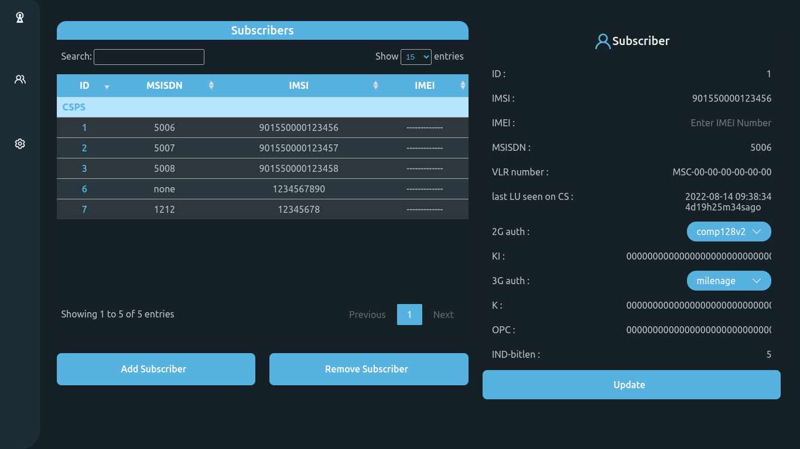

# osmo-gui - Osmocom GUI



This is the graphical user interface for the [Osmocom](https://osmocom.org/) project. This program is developed with Django framework. It is a web application that allows to manage the Osmocom network. However, it is not a complete web application.

## Installation

> It is recommended to install the latest [osmo-hlr 1.5.0](https://github.com/osmocom/osmo-hlr/releases/tag/1.5.0) as the django app is developed for this version.

Run the following command to install the app:

```bash
$ git clone https://github.com/ahnaf-tahmid-chowdhury/osmo-gui.git
$ cd osmo-gui
$ bash install.sh
```

## Usage

For now, only Osmocom HLR is supported. That means the app fetch the data from the Osmocom HLR vty and display it in a web page. Again one can able to add/delete/update the subscribers data through the application. However, the 'install.sh' script will install a GUI application using pywebview module thus there is no need to run the server. It will do it by own and launch the GUI program automatically. If you are interested in web application only, you can ignore the GUI installation by running the following command:

```bash
$ bash install.sh --no-gui
```

The server can be started by running the following command:

```bash
$ source [your-path]/osmo-gui/.env/bin/activate
$ python3 [your-path]/osmo-gui/manage.py runserver
```

However, osmo-hlr should be running in the background. Else the app will not be able to fetch the data.

## Contributing

Contributions are welcome.

## License

This project is licensed under the MIT License.

## Author

Ahnaf Tahmid Chowdhury
